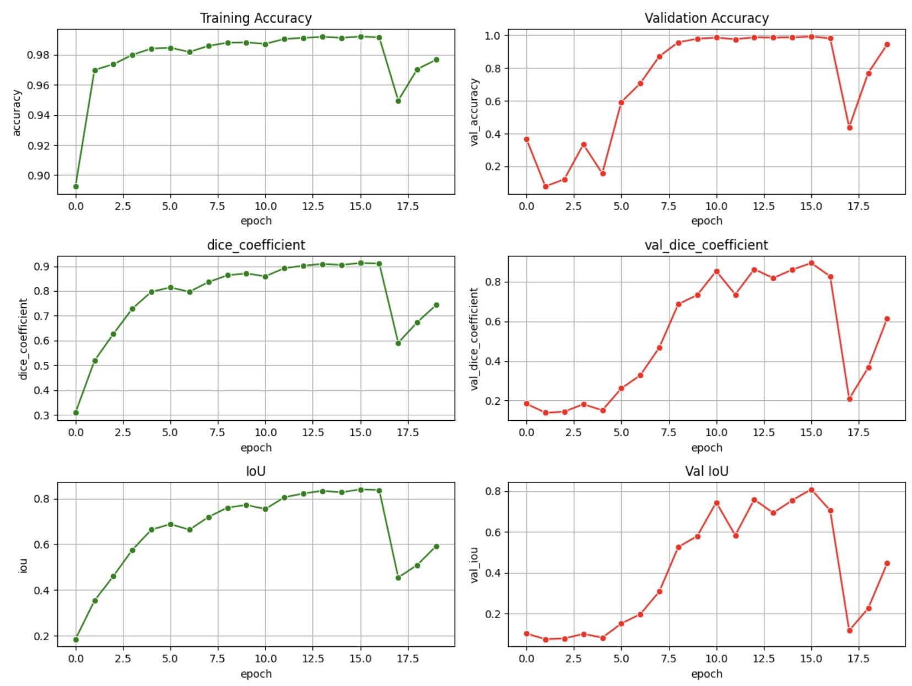
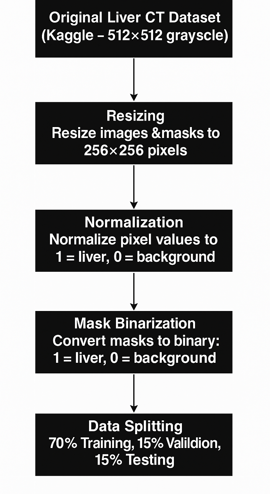

# Liver CT Scan Segmentation using Deep Learning

This project was developed as part of a **Minor Project** by our university team.  
The objective was to **automatically segment liver regions** from CT scan slices using **deep learning (U-Net)**.  

---

## 📌 Problem Statement
Manual segmentation of CT scans is time-consuming, error-prone, and requires expert radiologists.  
To assist in faster and more reliable medical image analysis, we built a deep learning pipeline to:
- Preprocess CT images
- Train a segmentation model
- Evaluate its performance using accuracy, Dice coefficient, and IoU

---

## 🗂 Dataset
- **Source**: Kaggle Liver CT Dataset  
- **Format**: 512×512 grayscale CT images with masks  
- **Preprocessing Steps**:
  1. **Resizing**: Images and masks resized to 256×256 pixels  
  2. **Normalization**: Pixel values normalized (1 = liver, 0 = background)  
  3. **Mask Binarization**: Ensured binary segmentation masks  
  4. **Splitting**: 70% training, 15% validation, 15% testing  

---

## ⚙️ Methodology
We implemented a **U-Net based segmentation pipeline**:

1. **Input**: Preprocessed CT images  
2. **Training**: Deep CNN with encoder-decoder (U-Net)  
3. **Evaluation**: Accuracy, Dice coefficient, IoU  

---

## 📊 Results
### Training & Validation Metrics
- Accuracy: ~98% (training), ~97% (validation)  
- Dice Coefficient: ~0.9 (training), ~0.85 (validation)  
- IoU: ~0.8 (validation peak)  

### Sample Predictions
Below are examples of input CT scans with their segmentation masks:

---

## 🚀 Tools & Technologies
- Python, NumPy, Pandas  
- TensorFlow / Keras  
- Matplotlib for visualization  
- Kaggle Dataset  

---

## 👩‍💻 Team Members
- RajSimar Singh 
- Sahildeep Singh  
- Nitin   

---

## 📌 Future Work
- Improve performance using **attention-based U-Net** or **Transformers**  
- Extend to multi-organ segmentation  
- Deploy as a **web application** for radiologists  

---

## 📷 Workflow

---

## 📖 Citation
If you use this work, please cite the Kaggle dataset used in the project.
